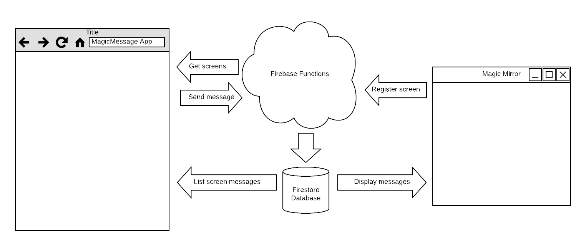

# Magic Message

This is the app and server software for my MMM-MessageToMirror module, which is a module for MagicMirror. See my [magic](https://github.com/ottopaulsen/magic) repository for more information.

The magic message project idea came from my daughter. I use to send an SMS to my wife when I leave work, so she can time when the dinner is ready (yes, she is nice, and I love her). However, some times it is not my wife that is home preparing dinner, but one of my kids. So the idea came from my oldest, Hilde, when we got the info-screen in our kitchen. "Can't you just send the message to the screen, so the right person gets it no matter who is making dinner?". But of course. I would love to do that.

The problem could have been solved a lot easier than I have done it, for example using the Slack module or any other module that integrates with a messageing or similar system. However, I wanted to use this oportunity to expand my knowledge on some specific technologies. So here is what I have done: 



* A mobile app to send the message. 
* A Firebase functions module used to send the messages, register and list screens. 
* A Firestore database to save messages, so that they can retain through mirror restarts.
* A MagicMirror module (MMM-MessageToMirror) to display the messages directly from the Firestore database.

This makes a rather complicated architecture, and of course, a lot more complicated than absolutely necessary. The reason is just that I wanted to learn those things. However, it is kind of cool, and if gives a lot of oportunities to refined fnuctionality.

## Magic Message App

I have created two similar apps for sending messages to the mirror. I started with one version using Angular and Ionic. Then I made a new one using React. Later I threw out Ionic and made it clean Angular with Meterial Design.

The reason I did this was just to learn the different tools. 

The apps are in two different repositories:

[MagicMessage Angular App](https://github.com/ottopaulsen/magic-message-angular-app)

[MagicMessage React App](https://github.com/ottopaulsen/magic-message-react-app)


## Magic Message Functions

The functions are used to serve the app. See the [MagicMessage Functions](https://github.com/ottopaulsen/magic-message-functions) repository.

Please note that not all app features are available in the Functions, since the app reads messages directly from the database. I did this for two reasons: 1) Just to try that, and 2) It updates super easy in the app when using Google Firestore.

## Database

I am using Googles new Firestore database to store messages. All you need to do is to create a Firebase project and a Firestore database, and get the configuration data into the other systems. You can use the same firebase project for both the functions and the database.

The only database related code in this repository is the database rules.

### Security

If I want to publish the MMM-MessageToMirror module using my own server components, it has to have some level of security. At the same time I don't want to make it too complicated to set up and use it. The solution is as follows:

* The user has to log in to be able to send messages. I use Google authentication for this, so you must have a Google account to use this. Through this, I get the email address. This is used to configure who are allowed to send messages to the mirror. It is also used to let you select which mirror you want to send message to, in case you have access to multiple mirrors.

* The screen is registering at startup, with a unique id. Through the module configuration, this id is connected to your email address. This is stored in the firestore database through a firebase function. This function is open, so the screen can register itself with no authentication. Of course, here is a potential problem, but there is not much use in registering a lot of fake screens, other than fucking up the system so that I have to close it down.

* The database is secured so that only the firebase functions can write to it, securing that only the legal stuff is written. In order to read messages, you have to know the unique screen id, and only the screen knows that, so it should be safe enough.

Currently you will be using my firebase function and my firestore database if you are using this solution, unless you set up your own server. If the usage is climbing to a level where I have to start paying Google for this, I may have to close it down. That may happen without any notice.


# Maintainance

Deploy database rules to Firebase using the following cli command:

```
firebase deploy --only firestore:rules
```


